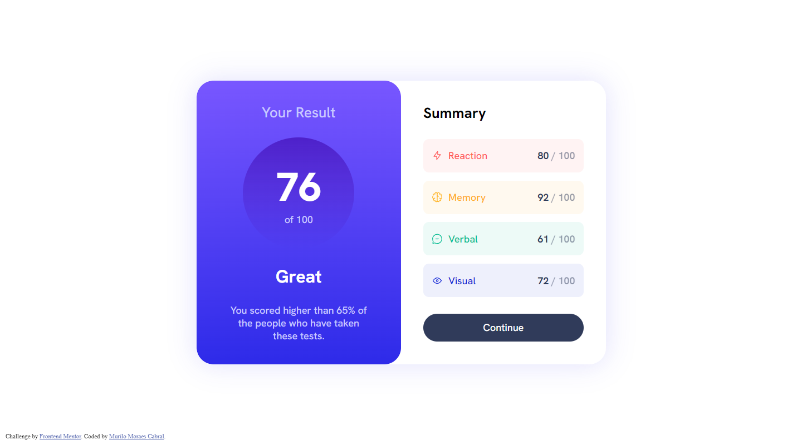

# Frontend Mentor - Results summary component solution

This is a solution to the [Results summary component challenge on Frontend Mentor](https://www.frontendmentor.io/challenges/results-summary-component-CE_K6s0maV). Frontend Mentor challenges help you improve your coding skills by building realistic projects. 

## Table of contents

- [Overview](#overview)
  - [The challenge](#the-challenge)
  - [Screenshot](#screenshot)
  - [Links](#links)
  - [Built with](#built-with)
  - [What I learned](#what-i-learned)
- [Author](#author)

## Overview

### The challenge

Users should be able to:

- View the optimal layout for the interface depending on their device's screen size
- See hover and focus states for all interactive elements on the page

### Screenshot

### Links

- Live Site URL: [Results summary component](https://murilomcabral.github.io/frontendmentor/002-results-summary-component-main/)

### Built with

- [VS Code](https://code.visualstudio.com/)
- Semantic HTML5 markup
- CSS custom properties
  - Mobile-first workflow
  - Flexbox
- Javascript
- JSON

### What I learned

- Retrieve and manipulate data from JSON
- Increasing number animation

## Author

- Github - [Murilo Moraes Cabral](https://github.com/murilomcabral)
- Frontend Mentor - [@murilomcabral](https://www.frontendmentor.io/profile/murilomcabral)

---

< [Back to Table of contents](#table-of-contents)