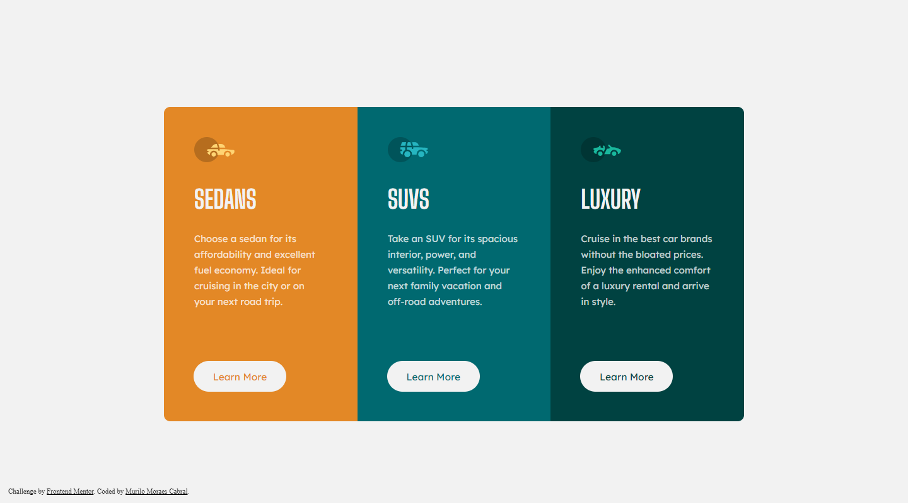

# Frontend Mentor - 3-column preview card component solution

This is a solution to the [3-column preview card component challenge on Frontend Mentor](https://www.frontendmentor.io/challenges/3column-preview-card-component-pH92eAR2-). Frontend Mentor challenges help you improve your coding skills by building realistic projects.

## Table of contents

- [Overview](#overview)
  - [The challenge](#the-challenge)
  - [Screenshot](#screenshot)
  - [Links](#links)
  - [Built with](#built-with)
  - [What I learned](#what-i-learned)
- [Author](#author)

## Overview

### The challenge

Users should be able to:

- View the optimal layout depending on their device's screen size
- See hover states for interactive elements

### Screenshot

### Links

- Live Site URL: [Order summary component](https://murilomcabral.github.io/frontendmentor/007-3-column-preview-card-component-main/)

### Built with

- [VS Code](https://code.visualstudio.com/)
- Semantic HTML5 markup
- CSS custom properties
  - Desktop-first workflow
  - Grid
  - Flex

### What I learned

- Better grid control

## Author

- Github - [Murilo Moraes Cabral](https://github.com/murilomcabral)
- Frontend Mentor - [@murilomcabral](https://www.frontendmentor.io/profile/murilomcabral)

---

< [Back to Table of contents](#table-of-contents)