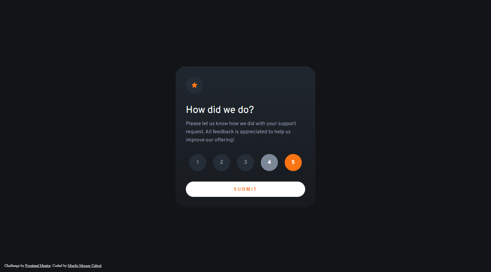

# Frontend Mentor - Interactive rating component solution

This is a solution to the [Interactive rating component challenge on Frontend Mentor](https://www.frontendmentor.io/challenges/interactive-rating-component-koxpeBUmI). Frontend Mentor challenges help you improve your coding skills by building realistic projects. 

## Table of contents

- [Overview](#overview)
  - [The challenge](#the-challenge)
  - [Screenshot](#screenshot)
  - [Links](#links)
  - [Built with](#built-with)
  - [What I learned](#what-i-learned)
- [Author](#author)

## Overview

### The challenge

Users should be able to:

- View the optimal layout for the app depending on their device's screen size
- See hover states for all interactive elements on the page
- Select and submit a number rating
- See the "Thank you" card state after submitting a rating

### Screenshot

### Links

- Live Site URL: [Interactive rating component](https://murilomcabral.github.io/frontendmentor/008-interactive-rating-component-main/)

### Built with

- [VS Code](https://code.visualstudio.com/)
- Javascript (for submit button and svg animation)
- HTML5 markup
- CSS custom properties
  - Desktop-first workflow
  - Grid
  - Flex
- Affinity Design (svg edit)

### What I learned

- I still need more planning before starting. Taking some time to plan first could've saved me some good time developing my css
- Learned more about using grid and flex together

## Author

- Github - [Murilo Moraes Cabral](https://github.com/murilomcabral)
- Frontend Mentor - [@murilomcabral](https://www.frontendmentor.io/profile/murilomcabral)

---

< [Back to Table of contents](#table-of-contents)